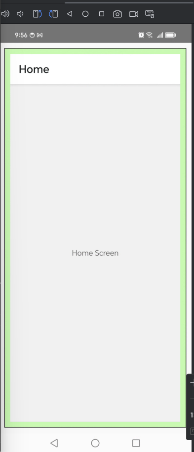

# App para abdroid - React Native

> **Note**: Varias aplicaciones para revisar temas de React Native

## Paso 1: Comandos configurar y subir ambiente:

    rama: develop
    	> ..\RN_Study_2024>  			yarn
    	> ..\RN_Study_2024>				npm i                 					   (npm i --legacy-peer-deps  /  npm i --force)
    	> ..\RN_Study_2024>				npx react-native start --reset-cache	(limpiar cache)
    										   npm cache clean --force					   (opcinal)
    	> ..\RN_Study_2024\android>	gradlew clean 							      (limpiar )
    	> ..\RN_Study_2024>				npx react-native run-android 			   (correr)

## Paso 2: Iniciar el Metro Server

Primero, necesitas iniciar **Metro**, the JavaScript _bundler_ that ships _with_ React Native.

Para iniciar metro, corre el siguiente comando from the _root_ of your React Native project:

```bash
# using npm
npm start

# OR using Yarn
yarn start
```

## Paso 3: Iniciar tu APP

Vamos a correr Metro Bundler en la terminal.

### Para Android

```bash
# usando npm
- npm run android o
- npx react-native run-android

# O usuando Yarn
yarn android
```

### Para iOS

```bash
# Usando npm
npm run ios

# O usuando Yarn
yarn ios
```

# Navigation APP: https://reactnavigation.org/docs/getting-started

- React Navigation se compone de algunas utilidades básicas que luego los navegadores utilizan para crear la estructura de navegación en tu aplicación. No te preocupes demasiado por esto por ahora, ¡se aclarará pronto! Para adelantar el trabajo de instalación, también instalemos y configuremos las dependencias que utilizan la mayoría de los navegadores, luego podemos comenzar a escribir algo de código.

- Las bibliotecas que instalaremos ahora son:
  - npx expo install react-native-screens react-native-safe-area-context

## Hola React Navigation

- En un navegador web, puedes vincular a diferentes páginas usando una `<a>` etiqueta de ancla ( ). Cuando el usuario hace clic en un enlace, la URL se envía a la pila del historial del navegador. Cuando el usuario presiona el botón Atrás, el navegador saca el elemento de la parte superior de la pila del historial, por lo que la página activa ahora es la página visitada anteriormente. React Native no tiene una idea incorporada de una pila de historial global como la tiene un navegador web; aquí es donde React Navigation entra en escena.

- El navegador de pila nativo de React Navigation ofrece una forma de que tu aplicación haga la transición entre pantallas y administre el historial de navegación. Si tu aplicación usa solo un navegador de pila, entonces es conceptualmente similar a cómo un navegador web maneja el estado de navegación: tu aplicación inserta y extrae elementos de la pila de navegación a medida que los usuarios interactúan con ella, y esto da como resultado que el usuario vea diferentes pantallas. Una diferencia clave entre cómo funciona esto en un navegador web y en React Navigation es que el navegador de pila nativo de React Navigation proporciona los gestos y animaciones que esperarías en Android e iOS al navegar entre rutas en la pila.

- Comencemos demostrando el navegador más común, createNativeStackNavigator.

- Las bibliotecas que hemos instalado hasta ahora son los bloques de construcción y las bases compartidas para los navegadores, y cada navegador en React Navigation reside en su propia biblioteca. Para usar el navegador de pila nativo, necesitamos instalar @react-navigation/native-stack:

- createNativeStackNavigatores **una función que devuelve un objeto que contiene 2 propiedades: Screeny Navigator. Ambos son componentes de React que se utilizan para configurar el navegador. NavigatorDeben contener Screenelementos como sus hijos para definir la configuración de las rutas**

##### Características

- NavigationContaineres un componente que administra nuestro árbol de navegación y contiene el estado de navegación . Este componente debe contener la estructura de todos los navegadores. Por lo general, renderizaríamos este componente en la raíz de nuestra aplicación, que suele ser el componente exportado desde App.js.

- React Native no tiene una API integrada para la navegación como la de un navegador web. React Navigation te la ofrece, junto con los gestos y animaciones de iOS y Android para realizar transiciones entre pantallas.

- Stack.Navigatores un componente que toma la configuración de ruta como sus hijos con accesorios adicionales para la configuración y representa nuestro contenido.

- Cada Stack.Screencomponente toma una name propiedad que hace referencia al nombre de la ruta y componentuna propiedad que especifica el componente que se va a renderizar para la ruta. Estas son las dos propiedades requeridas.

- Para especificar cuál es la ruta inicial en una pila, proporcione un initialRouteNamecomo propiedad para el navegador.

```
<Stack.Screen
  name="Home"
  component={HomeScreen}
  options={{ title: 'Overview' }}
/>
```

- Para especificar opciones específicas de la pantalla, podemos pasar una optionspropiedad a Stack.Screen, y para opciones comunes, podemos pasar screenOptionsaStack.Navigator

- Pasar parámetros

```
  <Stack.Screen name="Home">
    {(props) => <HomeScreen {...props} extraData={someData} />}
  </Stack.Screen>
```

##### Salida



##### Mejoras

- Para recibir parámetros con TypeScript se debe definir una interface

```
  ...
  interface ComponentProps {
    param: string;
    navigation: any;
  }
  export const HomeScreen: React.FC<ComponentProps> = ({param, navigation}) => {
    return (
      <View style={styles.container}>
        <Text>Home Screen: {param}</Text>
        <Button
          title="Ver Detalles"
          onPress={() => navigation.navigate('Details')}
        />
      </View>
    );
  };
  ...
```

- Se utilitiza el navigation.navigate para vijara entre vistas (RN)

```
  onPress={() => navigation.navigate('Details')}
```

- Se utilitiza el navigation.goBack para regresar entre vistas (RN)

```
  onPress={() => {
    navigation.goBack();
  }}
```

- Se utilitiza el navigation.popToTop para regresar a la vista principal (RN)

```
  navigation.popToTop()

  o podría utilizar

  navigation.navigate('Home')
```

- navigation- la navigation propiedad se pasa a cada componente de pantalla ( definición ) en el navegador de pila nativo.
  navigate('Details')- llamamos a la navigate función (en la navigation propiedad) con el nombre de la ruta a la que nos gustaría mover al usuario.

- Si llamamos navigation.navigate con un nombre de ruta que no hemos definido en un navegador, se imprimirá un error en las compilaciones de desarrollo y no ocurrirá nada en las compilaciones de producción. Dicho de otra manera, solo podemos navegar a rutas que se hayan definido en nuestro navegador; no podemos navegar a un componente arbitrario.

- Supongamos que realmente queremos agregar otra pantalla de detalles. Esto es bastante común en los casos en los que se pasan datos únicos a cada ruta (¡hablaremos más sobre esto más adelante cuando hablemos de params!). Para ello, podemos cambiar navigatea push. Esto nos permite expresar la intención de agregar otra ruta independientemente del historial de navegación existente.

```
  <Button
    title="Go to Details... again"
    onPress={() => navigation.push('Details')}
  />
```

#### Pasando parámetros a las rutas

Esto consta de dos partes:

- Pase parámetros a una ruta colocándolos en un objeto como segundo parámetro de la navigation.navigatefunción:navigation.navigate('RouteName', { /_ params go here _/ })

- Lea los parámetros en su componente de pantalla: route.params.

- Se recomienda que los parámetros que pase sean serializables mediante JSON. De esa manera, podrá usar la persistencia de estado y sus componentes de pantalla tendrán el contrato correcto para implementar enlaces profundos.
